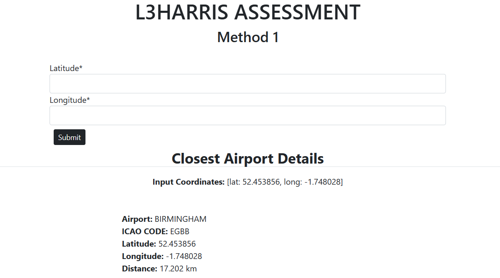

# L3HARRIS TASK

## TABLE OF CONTENT 
* [Introduction](#introduction)
* [Main Technologies used](#main-technologies-used)
* [Task](#task)     
* [Installation](#installation)
* [Haversine Formula](#installation)
* [Design Approach](#design-approach)
* [Command Line Inteface](#command-line-interface)
* [Django interface method 1](#django-interface-method-1)
* [Django interface method21](#django-interface-method-2)
* [Flask Inteface](#flask-interface)
* [API Endpoint](#api-endpoint)
* [Output Format](#output-format)  
* [Development Time](#development-time)
* [Error Handling](#error-handling)
* [Testing](#testing)
* [Future improvements](#future-improvements)


## INTRODUCTION 

This section provides details on the technology and methodology used for the L3HARRIS recruitment task.

## TASK

Write a program that accepts a decimal logitude and latitude location and displays the closest airport from a data file provided.


## MAIN TECHNOLOGIES USED

* Python (v3.9.13)
* pandas package for distance computations
* Django for user interface and storing airport details
* unitest


## INSTALLATION

1. create virtual environment using :  ``` python -m venv .venv ```
2. Activate virtual environment: ``` .\.venv\Scripts\activate ```
3. Install all libraries: ``` pip install -r requirements.txt ```
4. When using method 3 run the following to store airport into model:

        ``` python manage.py makemigrations ```

        ``` python manage.py migrate ```

        ``` python manage.py store_airport ```


## HAVERSINE FORMULA

The shortest distance calculation was done using the Haversine Formula:

    a = sin²(φB - φA/2) + cos φA * cos φB * sin²(λB - λA/2)

    c = 2 * atan2( √a, √(1−a) )

    d = R ⋅ c

The python function executing the formula can be found [here](api/utils.py)


## DESIGN APPROACH

Three methods were used to obtain nearest airport:
1. Command line interface. 
2. Django with input form interface using CSV to create dataframe.
3. Django with input form interface using models to create dataframe.


## COMMAND LINE INTERFACE

This interface provides a mean to obtain nearest airport by running the command ``` python main.py ```. 

This method creates a dataframe directy from csv file.


## DJANGO INTERFACE METHOD 1

This method provides a form interface to input latitude and longitude and renders the results to the same page in a tabular format```

The dataframe is created directy from csv file.

- Command to un Django Locally : ``` python manage.py runserver ```




## DJANGO INTERFACE METHOD 2

This method provides a form interface to input latitude and longitude and output the response as a json file.

This method creates a dataframe from the Django Model and requires the following command to run inorder to store the airport details into the model.

    ``` python manage.py store_airport ```

- Command to un Django Locally : ``` python manage.py runserver ```

- output:

    <pre>
        {"input_latitude": 52.489471, "input_longitude": -1.898575, "airport": "BIRMINGHAM", "latitude": 52.453856, "longitude": -1.748028, "icao_code": "EGBB", "distance": "17.202 km"}

    </pre>


## OUTPUT FORMAT

The output format included the following fields as per test requirements:

- input latitude
- input longitude
- nearest airport name
- latitude of airport
- longitude of airport
- icao code
- distance


## DEVELOPMENT TIME

* Approximately 5 hours developing code
* 2 days of testing

## ERROR HANDLING

4 basic measures was put in place for error handling:

1. The first involved using regex to prevent inputting of wrong date format for Approach 1.
2. Http error handling for requests.
3. NoneType for flight not availble
4. A final exception case to catch all other errors.

Measures 2,3 and 4 made use of Python Exception handling.

## TESTING

Testing was done at 2 levels, unit testing and api endpoint testing.

### UNIT TESTING

Unit testing was perfommed using Python's pytest. The code can be found in ``` test.py ``` and ``` flask_test.py ```.

A total of 15 tests were performed to test the integrity of all functions. Test covered the following items:
1. Response status with correct data
2. Response status with incorrect data
3. Result type
4. Result length
5. Check if results contain required data
6. response status


### API endpoint testing

A test api endpoint was created  (``` http://127.0.0.1:5000/test_api```) to allow the saving of response to a csv file. The request to the endpoint was made with Postman and random entries were then compared to those on the actual site.

The test results can be found [here](document/test.csv)

## FUTURE IMPROVEMENTS

1. The airport input assummed IATA airport code and could be modified to accept airport names.
2. In this instance the API endpoint is been run locally. However in production, a JWT authorisation system would be implemented to limit access.
3. Complete results could be obtained by changing the parameters on the get request. For example results for infants could be obtained.
4. Check the airport input against a list of all airports present in the Aer Lingus database and provide validation before running script so as to prevent bad requests.
5. Create an automated testing script which would use selenium. Create a list of possible search parameters combinations and have selenium input those parameters into the actual site and then scrape the results from the site directly. The results would then be compared with those returned from the API. 
6. If data would need to be persisted for analysis purposes I would change the tech to Django Rest Framework(DRF) to optimise management of requests, data storage and data retrieval. DRF also includes JWT out of the box hence would be easy to integrate.